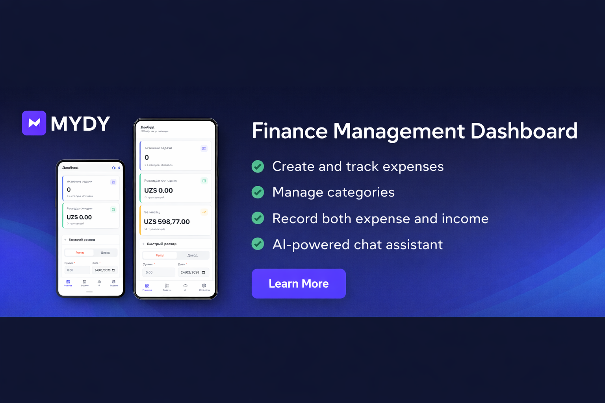

<p align="center">
  
</p>

<p align="center">
  
</p>

<h1 align="center">MYDY DASHBOARD</h1>

<p align="center">
  A personal dashboard with Kanban board, expense tracker, AI financial advisor, and Telegram Mini App.
</p>

<p align="center">
  
  
  
  
  
  
  
</p>

---

## Features

### Dashboard
The home page gives you a bird's-eye view of everything at once — active tasks, completed tasks, today's and monthly spending — plus a quick expense form and a recent transactions panel.

### Kanban Board
Full-featured task management with multiple boards, custom columns, and drag-and-drop. Completed tasks can be archived in bulk and restored at any time.

### Finance Tracker
Track both **expenses and income** with custom color-coded categories. Built-in charts cover daily, weekly, and monthly breakdowns. Supports setting an initial balance for accurate running totals. History view with period filters (day / week / month / year / all).

### AI Financial Advisor
Powered by **Claude, OpenAI, or Groq** — your choice. Analyzes today's expenses on demand and holds a full chat with streaming responses. Maintains **multiple conversations** with persistent history.

**AI Memory** stores personal facts as vector embeddings (Jina AI + pgvector). The advisor automatically extracts facts from conversations using Groq, so it remembers your habits and context across sessions.

Supported models:
- **Anthropic** — Claude Sonnet 4.6, Haiku 4.5, Opus 4.6
- **OpenAI** — GPT-4o, GPT-4o Mini, GPT-3.5 Turbo
- **Groq** — Llama 3.3 70B, Llama 3.1 8B, Mixtral 8x7B, Gemma 2 9B

### Telegram Bot
Add expenses in seconds by texting the bot. Natural language input is parsed by AI — it extracts amount, category, and date automatically. Inline keyboard buttons let you confirm or edit before saving.

| Command | Description |
|---|---|
| `/add 500 coffee` | Add an expense |
| `/today` | Today's expenses |
| `/help` | List of commands |

### Telegram Mini App (TMA)
A full mobile-optimized interface embedded directly inside Telegram. Five sections accessible via bottom navigation:

| Section | Description |
|---|---|
| **Home** | Stats summary, quick expense form, recent transactions |
| **Tasks** | Kanban boards with horizontal column scrolling |
| **Finance** | Expense list, period summary |
| **Work** | Check-in/out, shift history, weekly/monthly stats |
| **AI Chat** | Streaming AI advisor with conversation switcher |
| **Settings** | Language, currency, AI provider, categories, bot connection |

Includes haptic feedback, Telegram safe area support, and a dedicated `tma-auth` middleware.

### Work Time Tracker
Track work hours with one-tap check-in / check-out. The current shift is displayed as a live timer. The history view shows sessions grouped by week or month, with per-session duration, start/end time, and totals. Stats cards show hours this week, this month, and average shift duration.

Supports **iOS Shortcuts** integration — a webhook endpoint lets you automate check-in/out via location-triggered shortcuts. The webhook key can be regenerated at any time from Settings.

Work tracker is available both on the web dashboard and in the Telegram Mini App.

### Localization (EN / RU)
Full English and Russian interface. Language is selected in Settings (both web and TMA) and saved to the backend — it persists across devices.

Implementation: lightweight custom `useLocale` composable (no external library), reactive `$t()` helper, locale stored in `localStorage` + backend settings key. All dates, durations, and plural forms are locale-aware.

### Settings
- **Language** — English / Russian
- Currency code and symbol
- AI provider and model selection
- API keys: Anthropic, OpenAI, Groq, Jina
- Finance categories (CRUD with custom colors)
- Telegram bot token and webhook registration
- Work tracker iOS Shortcut webhook (generate / regenerate)
- Password change

---

## Deploy to Dokploy

[Watch the video guide](https://www.youtube.com/watch?v=EaMZUBrVKag)

[](https://www.youtube.com/watch?v=EaMZUBrVKag)

### Step 1 — Create PostgreSQL

Dokploy → **New Service → Database → PostgreSQL**

Note down the **service name** (will be `DB_HOST`), `Database`, `Username`, and `Password`.

### Step 2 — Create Application Service

Dokploy → **New Service → Application** → source **GitHub** → select repo and branch `main`.

Dokploy will automatically find the `Dockerfile` in the root of the repository.

### Step 3 — Set Environment Variables

In service settings → **Environment Variables**:

```env
# Required
APP_URL=https://your-domain.com

DB_CONNECTION=pgsql
DB_HOST=postgres           # service name from Step 1
DB_DATABASE=your_db_name
DB_USERNAME=your_db_user
DB_PASSWORD=your_db_password

# Optional
ANTHROPIC_API_KEY=sk-ant-...   # for Claude AI
OPENAI_API_KEY=sk-...          # for OpenAI models
GROQ_API_KEY=...               # for Groq models
JINA_API_KEY=...               # for AI memory embeddings
TELEGRAM_BOT_TOKEN=...         # for Telegram bot & Mini App
APP_KEY=base64:...             # auto-generated on first start
```

> `APP_KEY` is auto-generated on first start — recommended to move it to environment variables for stability.

### Step 4 — Deploy

Click **Deploy**. Build takes 2–4 minutes.

After startup, the container will wait for PostgreSQL, apply migrations, and seed default data automatically.

> **Default password: `secret`** — change it immediately in Settings.

---

## Local Development

**Requirements:** PHP 8.4, Composer, Node 20, PostgreSQL

```bash
# 1. Clone
git clone <repo> && cd personal-dashboard

# 2. Set up backend
cd back
cp .env.example .env
# Edit .env: DB_*, APP_KEY
php artisan key:generate
php artisan migrate:fresh --seed
cd ..

# 3. Set up frontend
cd front && npm install && cd ..

# 4. Start both servers
./start.sh
```

- Frontend: http://localhost:3000
- Backend API: http://localhost:8000/api

**Via Docker Compose:**

```bash
cp .env.example .env
# Set: DB_PASSWORD, APP_KEY (php artisan key:generate --show)

docker compose up --build
```

---

## Environment Variables

| Variable | Required | Description |
|---|---|---|
| `APP_URL` | Yes | Public URL (`https://your-domain.com`) |
| `DB_HOST` | Yes | PostgreSQL host (service name in Dokploy) |
| `DB_DATABASE` | Yes | Database name |
| `DB_USERNAME` | Yes | Database user |
| `DB_PASSWORD` | Yes | Database password |
| `APP_KEY` | No* | Encryption key. Auto-generated on first start |
| `ANTHROPIC_API_KEY` | No | Claude API key |
| `OPENAI_API_KEY` | No | OpenAI API key |
| `GROQ_API_KEY` | No | Groq API key (also used for memory fact extraction) |
| `JINA_API_KEY` | No | Jina AI key for vector embeddings |
| `TELEGRAM_BOT_TOKEN` | No | Telegram bot token |

*Recommended to set manually after first run (key will be in logs).

---

## Project Structure

```
├── back/               Laravel 11 API
├── front/              Nuxt 4 SPA (shadcn-vue, Tailwind v3)
├── docker/
│   ├── entrypoint.sh
│   ├── nginx.conf
│   └── supervisord.conf
├── Dockerfile          Multi-stage: Nuxt build → Composer → PHP-FPM + Nginx
├── docker-compose.yml  For local development
└── start.sh            Dev server launcher
```
